# Nine years of improving *Attention*

Post-2017 improvements that make long-context agentic LLMs possible

  Mohammad Taufeeque

<!--
Opening note to self: the goal is depth on a small number of mechanisms,
not a tour. Three buckets: KV-cache compression, sparse attention,
systems/kernels (time permitting).
-->

---

# Recap: the 2017 attention block

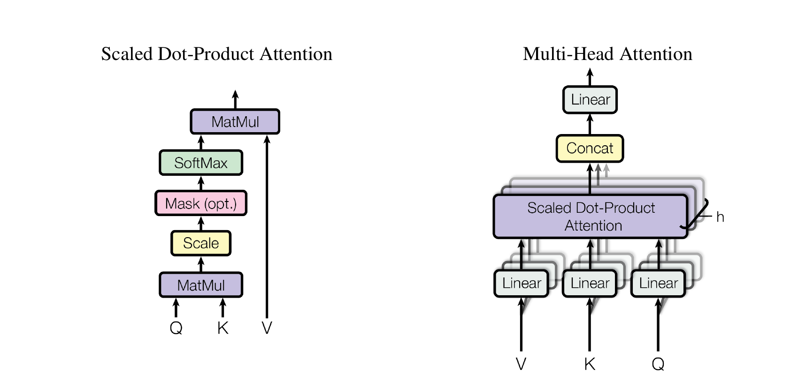

The block we'll attack:

- $H$ parallel **attention heads**.
- Each runs **scaled dot-product attention** on its own $Q, K, V$ projection.
- Outputs are concatenated, then a final linear projection $W_O$.
- For decoder self-attention: the **mask** zeroes out future positions.

Vaswani et al. 2017, Figure 2.

<!--
Don't dwell. Audience knows this. Two things to flag:
(1) K and V each have an H dimension. Every head has its own keys/values.
    That's what category (a) attacks.
(2) The QK^T softmax matrix is n × n per head. That's what category (c)
    attacks. Point to it on the figure.
-->

---

# Recap: notation and shapes

For one head $h$ at query position $i$ over $n$ context tokens:

$$
\text{Attn}_h(Q, K, V)_i = \mathrm{softmax}\!\left(\frac{q_i^{(h)} \, (K^{(h)})^\top}{\sqrt{d_k}}\right) V^{(h)}
$$

with $h \in [1, H]$ heads, each of dim $d_k = d_v = d / H$.

Shapes per layer, with batch $b$ and sequence length $n$:

| Tensor | Shape | Notes |
|---|---|---|
| $Q, K, V$ | $[b, H, n, d/H]$ | $H$ independent heads |
| Logits $QK^\top$ | $[b, H, n, n]$ | The $O(n^2)$ matrix |
| Output | $[b, H, n, d/H]$ → $[b, n, d]$ | After concat + $W_O$ |

<v-click>

The two highlighted dimensions — the <b>H in K, V</b> and the <b>n × n in the logits</b> — are the two things the whole talk is about.

</v-click>

<!--
This slide nails down the exact notation we'll modify across the talk.
H, n, d_k, b — those four letters appear on every later slide. The amber
callout is the through-line: K and V will get compressed (category a);
the n×n logits matrix will get sparsified (category c).
-->

---
layout: section
---

# The two cost walls at agent scale

---

# Prefill vs. decode are *different* problems

<PrefillVsDecode :n="16" :size="240" />

$O(n^2)$ compute per layer · $O(n \cdot d)$ activations · 1M-token prompt $\approx 10^{12}$ FLOPs / layer

$O(n \cdot d)$ compute per step · re-stream KV cache $O(b \cdot H \cdot n \cdot d_k)$ bytes / token

<v-click>

Both get worse with context length. Each wall needs different tools.

</v-click>

<!--
The framing for the whole talk lives on this slide. Prefill and decode are
not the same. Compute optimizations help one; bandwidth optimizations help
the other. Sparse attention is mostly a prefill story. KV compression is
mostly a decode story. Tell the audience this now and refer back.
-->

---

# Concrete: GPT-2 at the agentic edge

**GPT-2 large** (774M params, 2019): $L = 36$, $H = 20$, $d = 1280$, $d_k = 64$. Native context $n = 1024$.

What happens if we feed it a 1M-token prompt?

| Quantity | $n = 1024$ (native) | $n = 100\text{k}$ | $n = 1\text{M}$ |
|---|---|---|---|
| Attention prefill FLOPs (all $L$ layers) | 193 GFLOPs | 1.8 PFLOPs | **184 PFLOPs** |
| KV cache size (bf16) | 184 MB | 18 GB | **184 GB** |
| Decode bytes streamed per token | 180 KB | 18 GB | **184 GB** |

<v-click>

On one **H100** (≈ 1 PFLOPs BF16 dense, 80 GB HBM3 @ 3.35 TB/s):

- **Prefill attention at $n=1\text{M}$**: $\approx$ **184 s** (~3 min) of compute, attention math alone.
- **KV cache at $n=1\text{M}$**: 184 GB — **doesn't fit on one H100.** Need 3+ GPUs just for the cache.
- **Decode bandwidth ceiling**: 184 GB / 3.35 TB/s ≈ 55 ms/token → **~18 tokens / s**, even if the rest of the model were free.

</v-click>

<v-click>

And GPT-2 large is tiny. **Llama 3 70B** ($L=80$, $d=8192$) at $n=1\text{M}$ with full MHA: ~2.6 TB KV cache. With GQA: ~330 GB. The whole rest of this talk is the engineering that makes any of this tractable.

</v-click>

<!--
Walk through the prefill column first: at native 1024, attention is ~190
GF — negligible, microseconds. At 1M, 184 PFLOPs, ~3 minutes on a single
H100 just for the attention component. That's prefill at long context.

Then the KV column: at 1M, 184 GB. Doesn't fit on one H100 — you need
three GPUs *just to hold the cache*. And every decode token re-streams
the whole thing. Bandwidth-bound at ~18 tok/s.

Pause on this slide. The rest of the talk is about beating these two
ceilings. When MLA cuts the KV cache by 90%, decode goes from 18 tok/s
to ~180. When sparse attention turns O(n²) into O(n·k), those 3 minutes
become a few seconds. Real numbers.

GPT-2 large arch: L=36, H=20, d=1280, d_k=64 (verified from huggingface
config / GPT-2 paper). Derivation in reference.md.
-->

---

# What we'll cover

### (a) KV-cache compression

Attacks decode bandwidth.

- **MQA** — Shazeer 2019
- **GQA** — Ainslie 2023
- **MLA** — DeepSeek-V2 2024 (→ V3 training)

→ shrink the cached K, V.

### (c) Sparse attention

Attacks prefill compute.

- **SWA** — Longformer / Mistral / Gemma / OLMo / GPT-OSS / …
- **NSA** — DeepSeek 2025
- **DSA** — DeepSeek-V3.2
- **CSA + HCA** — DeepSeek-V4

→ each query reads $\ll n$ keys.

Synthesis: <b>DeepSeek-V4</b> (Apr 2026) composes a token compressor + DSA-style sparse selection + sliding window + interleaved layers + MQA-core + attention sinks + mixed-precision KV. One model touches every category.

Out of scope (one slide at the end): FlashAttention, PagedAttention, MoBA, Ring Attention, SSM / linear hybrids.

---
layout: section
---

# (a) KV-cache compression

MQA → GQA → MLA

---

# MQA → GQA: shared KV memory across heads

<GQAExplorer :H="32" :dk="128" :initial-g="32" :interval-ms="2000" />

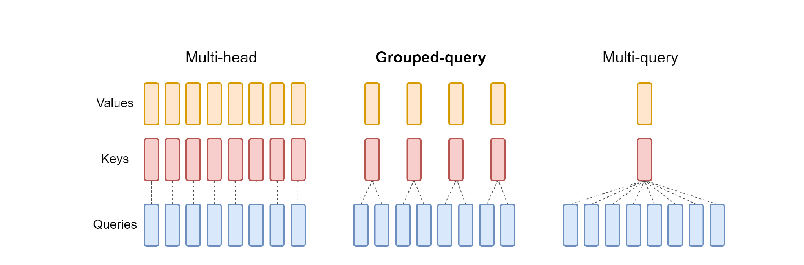

Ainslie et al. 2023, Figure 2.

<!--
The whole arc of MQA → GQA on one slide. Queries keep their diversity.
KV heads get collapsed by factor H/G. P_q and P_o still have h — only
the K/V projections and the cache shed dimensions. The figure makes the
"one knob G" idea visceral — three diagrams, one continuous spectrum.
-->

---

# The decode bottleneck — one generation step

Cache holds $n$ tokens; generating the $(n+1)$th. Per layer, per step:

<v-clicks>

**FLOPs:**
$$\underbrace{8 b d^2}_{\text{4 projections}\, (Q,K,V,O)} \;+\; \underbrace{4 b n d}_{\text{attention }QK^\top \!+ AV}$$

**Bytes loaded from HBM** (bf16):
$$\underbrace{8 d^2}_{\text{weights — loaded once per step}} \;+\; \underbrace{4 b n d}_{\text{KV cache — per sequence}}$$

**Arithmetic intensity** (FLOPs per byte):
$$\frac{8bd^2 + 4bnd}{8d^2 + 4bnd} \;=\; \boxed{\;\frac{b\,(2d + n)}{2d + b\,n}\;}$$

</v-clicks>

<v-click>

- $n \ll d$ (short cache): intensity $\approx b$ — weights amortize, batch helps.
- $n \gg d$ (long cache, **agent regime**): intensity $\approx$ **1 FLOP/byte** — **batch can't save you**, every sequence drags its own KV.

</v-click>

<v-click>

📌 Remember: long-context MHA decode ≈ 1 FLOP/byte.

</v-click>

<!--
Walk through the clicks:
  (1) FLOPs per step: 4 projections × b queries + attention against cache.
  (2) Bytes per step: weights loaded ONCE (the trick of batching) + KV
      cache loaded per-sequence (the dimension you can't escape).
  (3) Divide: clean closed form.
  (4) Two limits. Short context: ratio ≈ b — batch helps. Long context:
      ratio → 1 FLOP/byte — batch doesn't help, because each new
      sequence carries its own cache. THIS is why long-context decode is
      bandwidth-bound regardless of batch.
-->

---

# GQA-$G$: shrinks KV traffic by $H/G$

With $G$ shared KV-head pairs (instead of $H$), the KV bytes scale by $G/H$ while FLOPs are unchanged. At long context:

$$\text{arithmetic intensity} \;\longrightarrow\; \frac{H}{G} \text{ FLOPs/byte}$$

For $H = 32$: MHA gives **1**, **GQA-8 gives 4** (open-frontier default), MQA gives **32** — but unstable at scale.

<v-click>

**Where's the cutoff?** Dense BF16 peak arithmetic intensity:

| GPU | Peak BF16 (dense) | HBM bandwidth | FLOPs / byte |
|---|---|---|---|
| A100 (80 GB) | 312 TFLOPs | 2.0 TB/s | $\sim 156$ |
| H100 (SXM5) | 989 TFLOPs | 3.35 TB/s | $\sim 295$ |
| HGX B200 | 2.25 PFLOPs | 7.7 TB/s | $\sim 290$ |

</v-click>

<v-click>

📌 Remember: GPU peak ≈ 300 FLOPs/byte. GQA-8 gives 4. Still ~70× short.

</v-click>

<v-click>

KV-head reduction is necessary but **not sufficient**. **MLA** next: compresses the cache another order of magnitude. **Sparse attention** later: drops $n$.

</v-click>

<!--
The transition is one knob: replace H with G. Bytes scale by G/H, FLOPs
stay the same → arithmetic intensity scales by H/G. Honest framing:
even MQA's 32 FLOPs/byte is ~10× short of H100 peak. We can't reach
compute-bound by KV-head reduction alone. That sets up MLA (latent
compression beyond head-sharing) and sparse attention (drop n).
-->

---

# Why GQA-8, not MQA?

The math says $G = 1$ (MQA) gives the biggest intensity win — **32 FLOPs/byte**. It still lost. Two reasons unique to production scale:

<v-clicks>

1. **Training stability.** MQA-from-scratch suffered loss spikes and diverged on long-input fine-tuning (Ainslie 2023, Appendix A). GQA stayed stable.

2. **Tensor-parallel sharding.** $N$ partitions replicate the single MQA KV head — wasted memory across the shards. GQA-$G$ with $G = N$ gives each partition its own KV head; no replication.

</v-clicks>

<v-click>

So **production picked the second-best math** to get the first-best engineering: small-$G$ GQA is the open-frontier default — Llama 3/4, Mistral, Qwen 2.5/3, Gemma 2/3, Phi-4, Cohere Command A (Phi-3-mini was MHA+SWA; some Qwen variants use GQA-4).

</v-click>

<!--
The slide's whole job is to explain why GQA-8 won despite MQA having
better arithmetic intensity. The two reasons are *not* derivable from
the per-step math — they're physical/engineering constraints that bite
at scale. Spend a moment on each: stability matters because training
is the expensive part; sharding matters because frontier models all
run on multi-GPU partitions.

Adoption line is from plan.md research-agent claims; verify against
each model's report as we hit them in the talk.
-->

---

# MLA: compress to a latent, not share heads

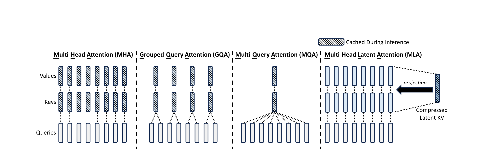

<v-click>

  <KVBlock kind="MHA" :H="32" :dk="128" />
  <KVBlock kind="GQA" :G="8" :H="32" :dk="128" />
  <KVBlock kind="MQA" :H="32" :dk="128" />
  <KVBlock kind="MLA" :dc="576" :H="32" :dk="128" label="MLA · dc+dhR" />

</v-click>

<v-clicks>

- Cache *one* low-rank latent $c_t^{KV} \in \mathbb{R}^{d_c}$ per token. All $H$ query heads read it, each extracting its own K, V via $W^{UK}_i$, $W^{UV}_i$.

</v-clicks>

DeepSeek-AI 2024, Figure 3. Strip below shows cached bytes/token to scale.

<!--
The figure is the talk's clearest visualization that MLA is structurally
different from MQA/GQA. MHA: H queries to H KVs. GQA: H queries to G KVs.
MQA: H queries to 1 KV. MLA: H queries to ONE compressed latent — but the
queries can each extract their own custom view of it.
-->

---

# MLA — the two clean pieces

<v-clicks>

**1. Low-rank joint compression** (what's cached):

$$c_t^{KV} = W^{DKV} h_t, \qquad k_t^C = W^{UK} c_t^{KV}, \;\; v_t^C = W^{UV} c_t^{KV}$$

DeepSeek-V2: cached latent $d_c + d_h^R = 576$ vs MHA's $2 H d_h = 32{,}768$ raw KV elements per token. **~57× compression in element count.**

**2. Absorption at inference** (the magic):

$W^{UK}$ folds into $W^Q$; $W^{UV}$ folds into $W^O$. Per query, attention is a $d_c$-dim dot product against the cached latent. **K and V are never materialized.** No decompression cost.

</v-clicks>

<v-click>

…but there's a third piece: <b>RoPE breaks the absorption trick</b>. Next two slides recap RoPE and show the fix.

</v-click>

<!--
Two clean pieces here, the messy third gets its own pair of slides:
  (1) Compression — obvious if you've seen low-rank approximation.
  (2) Absorption — the trick that makes (1) actually pay off. Without it,
      you save bytes but pay them back in decompression FLOPs.

The "RoPE breaks absorption" line at the bottom is the hook into the
next two slides — first a 30-second RoPE refresher, then a diagram of
the conflict and the side-channel fix.
-->

---

# RoPE in 30 seconds

<RoPESpinner :pairs="4" :max-pos="16" :tick-ms="280" :size="120" :d="64" :max-pair-index="8" />

- Rotary Position Embedding (Su et al. 2021). **The standard positional encoding** in every model in this talk.
- **Where:** applied to $q, k$ before the dot product. *Not* to $v$.
- **How:** rotate each $(q, k)$ dim-pair by an angle that grows linearly with position. Different rates per pair — a spectrum from fast (revolves every few tokens) to glacially slow (one rev every ~10K tokens).
- **Why it works:** $(R_{p_q} q)^\top (R_{p_k} k) = q^\top R_{p_k - p_q} k$ — dot product depends only on the **relative offset**.

Yellow = rotated $q$; dashed ghost = unrotated reference. Position $p$ loops 0 → 16. Spinners show 4 sample pairs across the fast end of the spectrum.

<!--
The recap nobody plans for. Audience knows the *name* "RoPE" but often
not the geometry. Spend 30 seconds:
  - Geometry: pair-wise 2D rotations. Watch the fast / slow pairs.
  - Algebra: the rotation matrix factors into the dot product, leaving
    only relative position. THIS is why RoPE generalizes to longer
    contexts than learned positional embeddings.
  - Anatomy: applied only to q and k, only inside attention. Not
    everywhere — that's important for the MLA conflict on the next slide.
-->

---

# MLA × RoPE — why absorption almost broke

<MLARoPE :interval-ms="4000" />

**No RoPE:** $W^Q$ absorbs $W^{UK}$ at inference. Per query, one matmul against the $d_c$-dim latent. Cheap.

**Naive RoPE:** position-dependent $R_p$ sits between $W^{UK}$ and the latent. Can't pre-fold — $R_p$ is different for every token. **Decompression cost returns.**

**Fix:** split $k$ into content $k^C = W^{UK} c$ (no RoPE, absorbable) and a tiny rotated side channel $k^R = R_p W^{KR} h$ ($d_h^R = 64$, shared across heads). Concat, then dot with $q$.

<!--
Three stages cycle every 4 s. Walk through them:

(1) "No RoPE": absorption works. W^Q · W^UK can be precomputed; per query,
    we dot the result with c directly. The KV cache is just c — small.

(2) "Naive RoPE": apply RoPE on K_raw. Now the chain is q · R_p · W^UK · c.
    R_p depends on the position of the cached token, which is different
    for every entry. We can't absorb W^UK into W^Q anymore — would need
    one folded matrix per position. Back to MHA's bandwidth pain.

(3) Fix: split. Most of K stays absorbable (no RoPE). A small extra
    channel carries position. Final attention sums two dot products.
    The content path retains the bandwidth win; the rotated channel is
    tiny (64 dims, shared across H heads, not H × 64) so the overhead
    is negligible.

THIS is what DeepSeek-V2 §2.1.3 calls "Decoupled RoPE." The diagram
makes clear why it exists — and why DSA / V4 keep using the same trick.
-->

---

# MLA — smaller KV cache, *better* quality

Table 9 (large MoE, ~250B total params):

| | MHA | **MLA** |
|---|---|---|
| KV cache per token | 860 K elements | **34.6 K** (**4%**, ~25× smaller) |
| BBH | 46.6 | **50.7** |
| MMLU | 57.5 | **59.0** |
| C-Eval | 57.9 | **59.2** |
| CMMLU | 60.7 | **62.5** |

Pareto-strict: MLA dominates MHA on **size AND quality** on hard benchmarks.

<v-click>

📌 Yet adoption was slow — DeepSeek + Kimi K2 only for 18 months. Why? →

</v-click>

<!--
The "size" axis we expected from a KV-compression slide. The "quality"
axis is the surprise: MLA beats MHA on 4/4 hard benchmarks at the
large-MoE scale.

Adoption note: MLA solved the math but lost the de-facto vote to GQA's
simpler retrofit. Open question to leave with the audience.
-->

---

# Why was MLA adoption so slow?

For 18 months: only **DeepSeek + Kimi K2** shipped it.

<v-clicks>

**The conflict.** MLA's speed depends on **absorption**: $W^{UK}$ folds into $W^Q$ → per-head $K$ is *never materialized*.

But **QK-Norm** — the 2025 stability default — normalizes per-head $k$ before the dot product. Forces $k$ to be materialized → kills absorption.

**Thawing** (late 2025 / 2026): **Mistral Large 3**, **GLM-5** (MLA + DSA). 

**DeepSeek-V4** sidesteps the conflict architecturally — we'll see how.

</v-clicks>

<!--
The "why didn't everyone adopt MLA?" puzzle is one of the most interesting
questions about the post-2024 frontier-architecture landscape. There's no
public "we tried it and failed" paper from any major lab — just silent
omission across Qwen, Gemma, Meta, Cohere, Microsoft, OpenAI tech reports.

Third-party engineering writing is what surfaces the most-cited concrete
technical reason: MLA's absorption trick (which is what makes the cache
small AND fast) is structurally at odds with QK-Norm, which became the
de-facto 2025 stability trick.

Mechanically: absorption means you never materialize per-head k_j; the
cached d_c-latent IS what attention sees. QK-Norm wants RMSNorm(q_i)
and RMSNorm(k_j) per-head — which means you have to materialize k_j.
Once you do that, the absorption savings vanish.

V4's §2.3.3 says explicitly: "the attention architecture of DeepSeek-V4
series allows us to directly apply RMSNorm on the attention queries
and KV entries" — the "allows us to" is the tell. V4's architecture
differs from V2/V3 MLA in that the cached entry IS the K=V tensor
(Shared-KV MQA on compressed entries) — no W^UK to absorb means no
absorption-vs-norm conflict.

The Muon-optimizer-without-QK-Clip detail is a nice side benefit story:
Kimi K2 had to invent QK-Clip to use Muon at scale (the optimizer
amplifies logit growth). V4 inherits Muon but doesn't need QK-Clip
because RMSNorm on Q and KV already keeps logits bounded.

Adoption thaw: Mistral Large 3 (Dec 2025) ships an MLA-based design
"heavily inspired by DeepSeek-V3" per Mistral engineer commentary on HF.
GLM-5 (Feb 2026) goes even further — MLA + DSA. Both still adopt V2/V3
style MLA absorption, so they presumably DON'T do QK-Norm. Worth
checking if Q&A comes up.

Open question to leave: will labs that committed to QK-Norm
(Qwen, Gemma, OLMo, OpenAI) follow V4's CSA/HCA route, or stay on
GQA permanently? V4 is the architectural existence proof that you
can have your KV compression and your QK-Norm too.
-->

---

# The full arc — arithmetic intensity climbed from 1 to ~240

<IntensityBars
  :x-min="1"
  :x-max="600"
  :width="640"
  :row-height="34"
  :ridge="{ value: 290, label: 'H100 ridge ≈ 290 — compute-bound beyond' }"
  :items="[
    { label: 'MHA',   value: 1,   color: '#60a5fa' },
    { label: 'GQA-8', value: 4,   color: '#a78bfa' },
    { label: 'MQA',   value: 32,  color: '#f472b6' },
    { label: 'MLA',   value: 240, color: '#34d399' },
  ]"
/>

<v-click>

MLA reaches within ~20% of H100 peak — *without* MQA's quality cost. The decode bandwidth wall is almost closed.

</v-click>

<!--
Closing slide of the (a) section. The progression is the talk's strongest
single visual: we walked the audience from "MHA: 1 FLOP/byte, 290× short
of peak" all the way to "MLA: 240 FLOPs/byte, within ~20% of peak."

Honest framing: ~240× intensity gain over MHA (240/1). The "first attention
to make decode compute-bound" framing is wrong because high-H MQA gets
similarly close; MLA's contribution is reaching it WITHOUT MQA's
training-stability and quality penalties.

The whole point of (a) on one slide. Pause here.

Transition: but we did this only by compressing the KV. The prefill wall
(O(n^2) compute, the n×n logits matrix) is untouched. Category (c) is
where we attack that.
-->

---

# V3 — training dense MLA at frontier scale

671B / 37B-active MoE. **\$5.6M** total cost. 14.8T tokens. Open weights.

<v-clicks>

**Stage the context length.** Pretrain at **4K** for 14.8T tokens (where $O(n^2)$ is cheap), then YaRN-extend to **32K** then **128K** — just 1000 steps each, **only ~4% of total training cost** (Table 1).

**Mixed precision.** Linear layers in **FP8** for speed and memory; **attention stays in BF16** (precision-sensitive softmax, small gradients); custom **E5M6 FP8** for the linear-after-attention activations (extra mantissa bits where the backward path needs them).

**Activation checkpointing — MLA-aware.** Don't store per-head K, V activations from forward. **Recompute them from the cached latent $c^{KV}$ during backward.** One extra matmul on the way back, big activation memory saved — only cheap because MLA's up-projection is from a small latent.

</v-clicks>

<v-click>

Dense MLA scales to frontier at $5.6M because attention is *carefully bounded*: short pretraining context + precision-aware kernel choices + MLA-specific activation tricks.

</v-click>

<!--
V3 closes the (a) section's production story. Architecture is MLA (V2),
arithmetic intensity is ~240 FLOPs/byte (prior slide). This slide answers:
how does that actually train at 671B params, 14.8T tokens, in $5.5M?

Three production tricks worth saying out loud:

(1) Stage context length: pretrain at 4K (cheap), extend with YaRN.
    Attention math at 4K is tractable; at 128K it would be prohibitive
    for 14.8T tokens. Extension is only 4.3% of total cost.

(2) Precision: linears go FP8, attention stays BF16. This is a recurring
    pattern in frontier training — attention's softmax and gradient
    magnitudes are sensitive enough that the FP8 risk isn't worth the
    win. E5M6 is the custom format for the boundary between attention
    (BF16) and the linear after it (FP8).

(3) MLA up-projection recompute = gradient checkpointing applied
    specifically to MLA. Cheap because the latent c^{KV} is small,
    so re-running the up-projection in the backward pass costs little.

Closing line: dense MLA isn't infeasible at frontier — it just requires
careful bounding (short pretraining context + precision discipline +
activation tricks). This is the production story behind the "256
FLOPs/byte" architectural claim.
-->

---
layout: section
---

# (c) Sparse attention — attacking the prefill wall

KV compression won decode bandwidth. Attention compute is still $O(n^2)$.

---

# Sliding window attention — depth does the long-range work

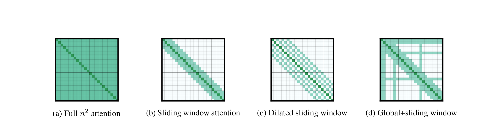

  <ReceptiveField :tokens="25" :layers="4" :window="2" :size="320" />
  
Receptive field at deepest layer grows ×<i>w</i> per layer. 24 × 512 ≈ 12K effective context.

<v-clicks>

- **SWA**: each token attends to $w$ neighbors. Compute drops from $O(n^2)$ to $O(n \cdot w)$.
- **Receptive field grows with depth**: $\ell$ layers × window $w$ → $\ell \cdot w$ effective context.

</v-clicks>

<v-click>

**Frontier decoder-only LLMs**: *interleaved* SWA-like layers with periodic full-attention.

- **Pure SWA** — Mistral 7B (2023, $w$=4096). Only one.
- **1:1** — Gemma 2 ($w$=4096) · GPT-OSS ($w$=128, + learned attention sinks)
- **3:1** — Cohere Command A (SWA-RoPE : Full-NoPE) · Llama 4 (iRoPE, chunked-RoPE : NoPE) · OLMo 3 ($w$=4096)
- **5:1** — Gemma 3 / Gemma 4-31B ($w$=1024)

</v-click>

<v-click>

📌 Still **static** — window size and pattern fixed at design time. Modern frontier: *learn* the sparsity. →

</v-click>

<!--
The (c)-section opener. One slide carries the whole "static sparse" arc:
  - Figure 2: the canonical visual for SWA.
  - The math: receptive field = layers × window. Why a small window doesn't
    actually limit long-range context, given depth.
  - Adoption: Longformer the paper targeted encoder-only RoBERTa; the
    intellectual descendants in frontier decoder-only LMs all interleave
    with periodic full-attention. Worth saying out loud: production
    didn't take Longformer's "SWA everywhere" framing.
  - Setup: static patterns are the limit. Next slide moves to *learned*
    sparse attention (NSA / DSA / MoBA / V4).

Speaker note: adoption details (window sizes, interleave ratios) are
left off the slide because they vary per model and I haven't verified
each tech report yet. Can add specifics if a Q&A asks.
-->

---

# NSA — trainable sparse attention from scratch

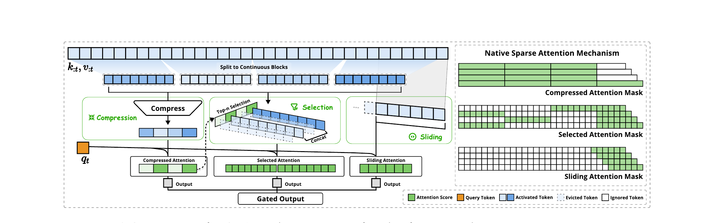

<v-clicks>

- **Three parallel branches** per query: compression (coarse), top-$n$ block **selection** (fine), sliding window (local). Outputs combined via learned gates.
- **"Native"**: trained sparse end-to-end from scratch. Prior sparse-on-pretrained-dense lost quality; NSA matches or **beats** Full Attention on hard benchmarks.

</v-clicks>

<v-click>

**Hardware-aligned by design**: selection works on contiguous **blocks**, not individual tokens. GPUs love block accesses (Tensor Cores need them) and hate random reads — same principle FlashAttention exploits. **Block-shared across heads in a GQA group**, so GQA's bandwidth wins still compose with sparsity.

</v-click>

<v-click>

📌 At 64K context: **11.6× decode**, **9× forward**, **6× backward** vs Full Attention — *and quality goes up*.

</v-click>

<!--
The (c)-section's main "trainable sparse" slide.

Walk through Figure 2:
  Left: three branches (cmp / slc / win), gated combination.
  Right: each branch's attention mask — cmp is dense over coarse
    compressed tokens; slc is sparse over selected blocks; win is
    local diagonal.

Key points to spend time on:
  1. "Native" = trainable from scratch — distinguishes from prior
     bolt-on-to-pretrained-dense approaches.
  2. Blockwise selection is the load-bearing hardware insight. Tensor
     Cores need contiguous block access. Sparse-but-random selection
     defeats this. NSA's blocks align with FlashAttention-style memory
     access.
  3. GQA-group-shared selection: all H/G heads in a group pick the SAME
     blocks → (a)'s bandwidth wins still apply. Direct counter to prior
     sparse methods that broke GQA.

Closing: 11.6× decode speedup AND quality improvement. Sparse-as-better
not sparse-as-cheaper. Frames the (c)-section punchline.

Shipped: next slide — DSA in DeepSeek-V3.2 is the production refinement.
-->

---

# NSA — the math

For a query $q_t$ at position $t$ with context $k_{:t}, v_{:t}$:

<v-clicks>

**Step 1 — remap K, V.** Choose query-dependent functions $f_K, f_V$ that produce compact, information-dense replacements for the full history:

$$\tilde K_t = f_K(q_t, k_{:t}, v_{:t}), \qquad \tilde V_t = f_V(q_t, k_{:t}, v_{:t}) \tag{3}$$

**Step 2 — attend against the remap.** Standard attention, but on $\tilde K, \tilde V$ instead of $k_{:t}, v_{:t}$:

$$o_t^* = \mathrm{Attn}(q_t, \tilde K_t, \tilde V_t) \tag{4}$$

**Step 3 — combine multiple remap strategies.** Use three remappings $C = \{\text{cmp}, \text{slc}, \text{win}\}$, combined via learned gates $g_t^c \in [0, 1]$:

$$o_t^* = \sum_{c \in C} g_t^c \cdot \mathrm{Attn}(q_t, \tilde K_t^c, \tilde V_t^c) \tag{5}$$

</v-clicks>

<v-click>

Each $f_K^c, f_V^c$ is **learned end-to-end** — that's what makes NSA "native." The three specific remappings (token compression, top-$n$ selection, sliding window) are what fill in the abstraction.

</v-click>

<!--
This is the "how it actually works" slide. The three equations are the
formal abstraction:

(3) The remapping idea: instead of attending to the full history, replace
    it with compact representations that depend on the query.

(4) Just standard attention on the remapped K, V. Crucially, sparsity
    enters through the SHAPE of the remap, not through changes to the
    attention math itself.

(5) The generalization: use multiple remap strategies in parallel,
    combine via learned gates.

Pedagogical note: equations (3)-(5) define the FRAMEWORK. The three
specific f_K, f_V (compression, selection, sliding) are the INSTANCES.
This abstraction is why DSA and V4 can plug in different f_K, f_V
and inherit the same training/inference machinery.

The amber line: "learned end-to-end" is what differentiates from prior
sparse attention (which had non-differentiable selection like k-means
clustering).
-->

---

# NSA — three design choices that make it actually work

<v-clicks>

**Where the sparsity comes from.** Total active K/V per query:

$$N_t \;=\; \underbrace{\lfloor t/d \rfloor}_{\text{compression}} \;+\; \underbrace{n \cdot l'}_{\text{top-}n\text{ selection}} \;+\; \underbrace{w}_{\text{sliding}} \;\;\ll\;\; t$$

Paper's hyperparameters: $l = 32$, $d = 16$, $n = 16$, $w = 512$. **At 32K context, NSA averages ~2560 active tokens / query — 8% of context** (paper §4.2). 11.6× decode speedup at 64K (Fig. 1) is the wall-clock consequence.

<SparsityBar
  :total="32768"
  :parts="[
    { label: 'compression (t/d)', value: 2048, color: '#60a5fa' },
    { label: 'top-n selection (n·l′)', value: 2048, color: '#a78bfa' },
    { label: 'sliding window (w)', value: 512, color: '#34d399' },
  ]"
  :width="620"
/>

**Top-$n$ selection is almost free.** Block importance scores come from *reusing the compression branch's attention output* (eq. 8; eq. 9 handles the block-scheme conversion when $l' \neq l$). No separate routing computation.

**Each branch has independent $K, V$ projections.** Without this, the easy-to-learn sliding-window branch's gradients dominate → compression and selection branches *starve* and never specialize. Independent projections let each branch learn its own representation.

</v-clicks>

<v-click>

📌 The 3-branch *architecture* is obvious. These three **design choices** — sparsity math, score-reuse, branch-independent K/V — are what made it work, and they cascade into DSA / V4.

</v-click>

<!--
This slide is the "why the paper is cool" beat — three non-obvious
design decisions that turn an obvious architecture into one that
actually trains and runs fast.

Walk through each click:

(1) Sparsity math: connect to the 11.6× decode speedup from the prior
    slide. The number isn't magic — it falls out of t/d + n·l' + w
    being small. Estimate at 64K context: ~9% of positions touched
    per query.

(2) Score reuse: clever. Compression branch already computed q·K_cmp.
    The selection branch could pay for an entirely separate scoring
    pass; NSA reuses what's already in cache. Eq. 8 maps directly to
    eq. 9 when block sizes align.

(3) Independent K, V: subtle but load-bearing. Local patterns are
    easier to learn — without this, the sliding window dominates the
    gradient signal and the other branches starve. Marginal compute
    cost (projections are small) for major training stability.

The amber line is the punchline: the architecture is obvious, the
engineering is what's hard. This sets up DSA/V4 which inherit and
refine these decisions.

Speaker note: hyperparameters and 2560-tokens-at-32K number are
verified from paper §4.1 and §4.2. The selection block size l' is
not explicitly stated; the 2560 measurement is what's directly
reported.
-->

---

# NSA trains as well as Full Attention

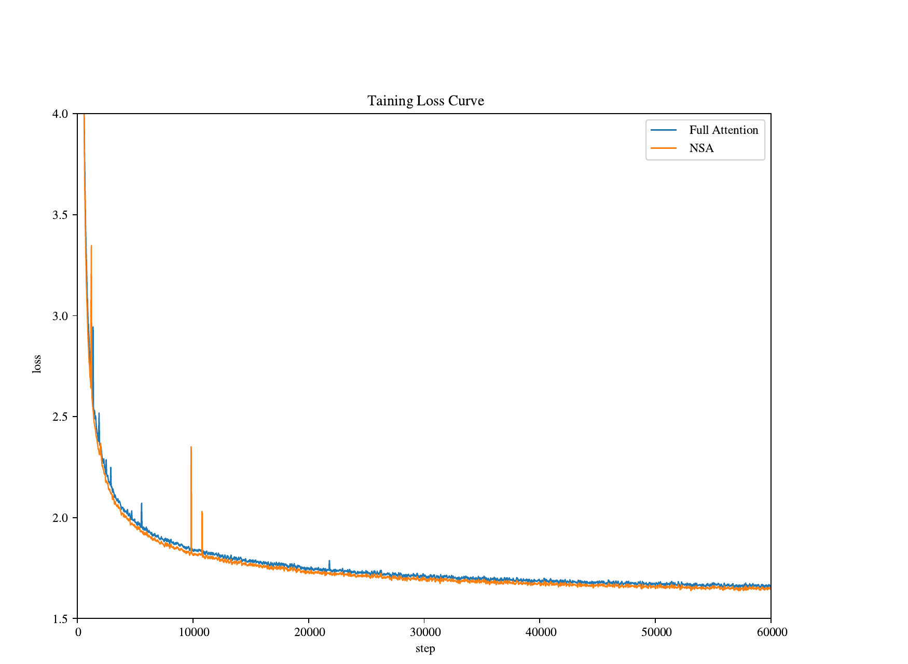

NSA's pretraining loss tracks Full Attention's closely throughout — and **ends slightly below**. Sparse-from-scratch isn't a training-time compromise.

DeepSeek-AI 2025, Figure 4. 27B-param model, 270B tokens at **8K** pretraining context (later extended to 32K via continued training).

<!--
Brief evidence slide. The earlier "matches/beats Full Attention" claim
on the architecture slide is supported by this curve — the gap is small
in absolute terms but consistent and reversed (NSA below). The user
takeaway: you can train sparse from scratch without sacrificing the
loss trajectory.
-->

---

# DSA — production trainable sparse attention (DeepSeek-V3.2)

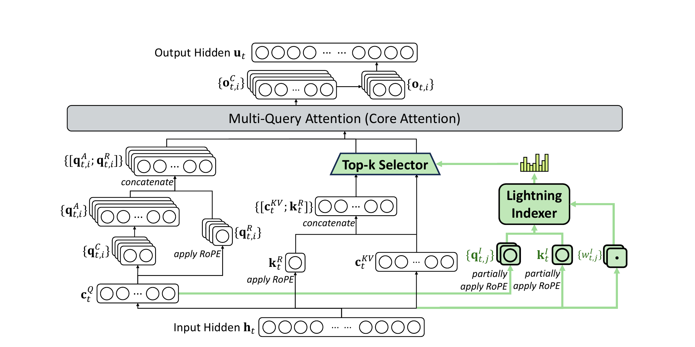

<v-clicks>

- **Lightning indexer**: cheap query-side scorer over every preceding token. Small heads, **ReLU not softmax**, **FP8** precision. Still $O(L^2)$ as a kernel — but with tiny constants.
- **Top-$k$ selector**: keep the best $k = 2048$ tokens per query by indexer score.
- **Core attention: MQA-mode of MLA** on selected tokens. Inherits MLA's KV-cache compression.

</v-clicks>

<v-click>

**One branch architecturally** — no explicit compression or sliding window like NSA. The DSA paper doesn't say *why* the simpler design works; could be that continued PT from a dense model doesn't need NSA's 3-branch inductive bias.

</v-click>

<!--
Walk through Figure 2:
  - Bottom: input hidden h_t. Latent down-projections produce c^Q (query) and c^KV (KV).
  - Right: green Lightning Indexer scores every preceding token cheaply.
  - Top-k Selector picks the best k entries from c^KV.
  - Left: query path applies RoPE on small portion, builds final query.
  - Center top: MQA core attention runs on the selected KV entries only.
  - Output hidden u_t.

Key points to spend time on:
  (1) Lightning indexer is cheap: ReLU (parallel, no normalization),
      FP8 (2x throughput vs BF16), small heads.
  (2) Top-k=2048: the selection budget. NSA used selection budget of
      similar order (16 blocks × ~128 tokens ≈ 2048) but split across
      three branches. DSA folds everything into one branch — the paper
      doesn't justify why this works; possibly because continued PT
      from dense inherits useful attention patterns, so the indexer
      doesn't need to learn multi-scale structure from scratch.
  (3) Built on top of MLA in MQA mode: one shared latent per cached
      token, shared across all H query heads. Inherits the (a)-section
      bandwidth win.

Simplification framing: production validated that with a big enough
top-k, a single selection branch covers everything NSA's three branches
did separately.
-->

---

# DSA training — *continued* pretraining from a dense model

Started from **DeepSeek-V3.1-Terminus** (dense MLA, 671B / 37B-active). NOT trained from scratch.

<v-clicks>

**Stage 1 — Dense warm-up** (2.1B tokens): freeze main model, train **only the indexer** via KL-divergence from the dense attention's distribution. The indexer learns to predict what dense attention attends to.

**Stage 2 — Sparse training** (943.7B tokens): switch on top-$k$, train all params end-to-end. Indexer continues to distill from dense on the selected token set.

**Stop-gradient + auxiliary loss.** Top-$k$ is non-differentiable, so:
- Main model gradients flow through *selected* K, V via LM loss
- Indexer trains via its own KL loss; **indexer input is detached** from the main computational graph
- The two paths never cross

</v-clicks>

<v-click>

📌 DSA is a **retrofit**: take an existing dense frontier model, sparsify it via cheap continued pretraining. Different value prop from NSA's "train sparse from scratch."

</v-click>

<!--
The "this is essentially knowledge distillation from dense attention
into the indexer" framing is the key insight. Walk through it:

  Stage 1: dense attention provides supervised target. Indexer learns
    to predict it. Cheap (only indexer params updated, 2.1B tokens).
  Stage 2: now the model uses top-k selections. Indexer keeps distilling
    from dense (but on the selected set only). Main model adapts to
    sparse pattern via LM loss.
  Stop-gradient: top-k breaks naive backprop. Solution: train the two
    pieces with separate losses, detach the bridge.

The "retrofit vs from scratch" distinction is important: V3.2 added
DSA to V3.1-Terminus with ~946B tokens of continued PT, much cheaper
than retraining a sparse model from scratch.
-->

---

# DSA — shipped: real wall-clock costs at scale

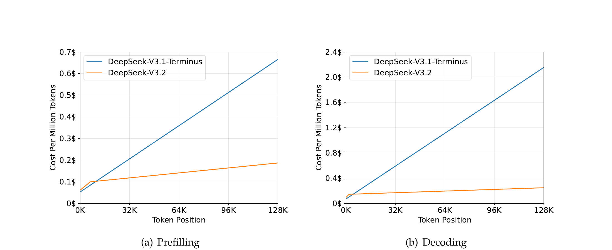

At **128K** context (vs V3.1-Terminus dense MLA, H800 cluster @ \$2/GPU-hr):

| Phase | Reduction |
|---|---|
| **Prefilling** | $0.7 \to 0.25$ per million tokens — **~2.8×** |
| **Decoding** | $2.4 \to 0.4$ per million tokens — **~6×** |

<v-click>

📌 Quality: matches V3.1-Terminus on standard benchmarks, ChatbotArena Elo unchanged, **+4 points on AA-LCR long-context reasoning**. Sparse-at-scale, no quality compromise. **First trainable-sparse-attention frontier model shipped.**

</v-click>

<!--
Figure 3 is the punchline: linear cost vs token position for V3.1
(dense), nearly flat for V3.2 (sparse). The dollar numbers are real
H800 deployment costs at the rental rate.

Decode improves ~6×, prefill ~2.8×. Decode > prefill is consistent
with the bandwidth-bound framing: per-token KV streaming was the
dominant cost.

Quality story: not a tradeoff. V3.2 either matches or beats V3.1 on
every evaluation they ran. Best result: +4 points on AA-LCR (long-
context reasoning) in reasoning mode.

"First shipped" framing: NSA was research (27B model, 270B tokens).
DSA is production (frontier scale, deployed). V4 takes both insights
and goes further.
-->

---

# DeepSeek-V4 — CSA (Compressed Sparse Attention)

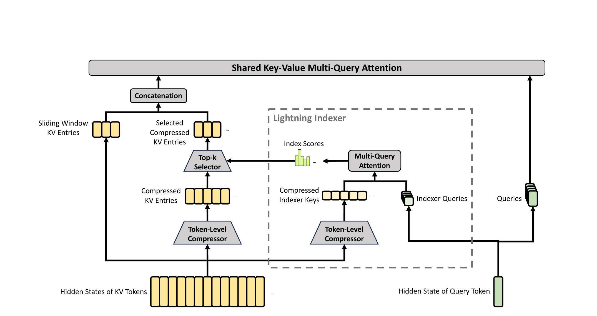

<v-clicks>

- **Compressor** → every $m{=}4$ tokens become 1 entry (overlapping). **Indexer + top-$k$** picks $k{=}1024$ of them
- **Sliding window** ($n_\text{win}{=}128$ uncompressed) is concatenated, one softmax over the union.
- **Shared-KV MQA**: each entry serves as both K *and* V. **Grouped output projection** keeps $W^O$ cheap.

</v-clicks>

<!--
V4 (Apr 2026, 1M-context). V4-Pro = 1.6T / 49B-active MoE.
Every layer is *either* CSA or HCA, interleaved. This slide = CSA.

Walk the figure:
  - Left path: hidden states → token-level compressor → compressed KV
    entries → top-k selector picks k=1024 of them.
  - Right (dashed): lightning indexer — its own token-level compressor
    on the same hidden states, then small MQA produces index scores
    that drive the top-k selector. Indexer trained DSA-style: dense
    pretraining → frozen-backbone indexer warmup with KL loss matching
    dense attention → full sparse training. No backprop through top-k.
    V4 §2.3.1 explicitly says "CSA applies the DSA strategy"; the KL
    loss form is in DSA's paper, not restated in V4.
  - Center top: sliding window KV entries (recent n_win=128 uncompressed)
    concatenated with the selected compressed entries — both go into the
    SAME softmax inside Shared-KV MQA. NSA had three parallel softmaxes
    with learnable gates; V4 has one softmax over the union. Simpler,
    no gate-training pathology.
  - SWA exists because causality: each query only sees preceding
    compressed blocks, so the most recent m tokens (still in the
    current uncompressed block) are invisible. SWA refills them.

Shared-KV MQA: the same compressed tensor plays BOTH K and V roles.
This is a 50% KV-bytes saving but causes the partial-RoPE problem on
the output side (covered two slides later).

Grouped output projection: V4-Pro has c·n_h = 65,536 and d = 7168, so
direct W^O would be ~470M params per layer. Grouped (g=16, d_g=1024)
splits this into c·n_h·d_g + g·d_g·d = 67M + 117M = 184M. ~2.6×
cheaper in this config — the saving compounds with batch and seq dims
in actual compute.

V4-Pro hyperparams (§4.2.1): m=4, k=1024, n_h=128, n_h^I=64,
c=512, d_c=1536, n_win=128, g=16, d_g=1024.
-->

---

# DeepSeek-V4 — HCA (Heavily Compressed Attention)

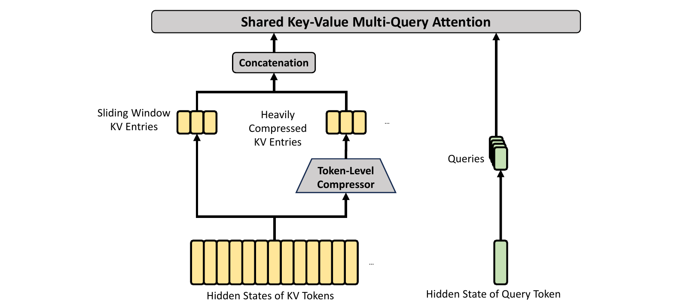

<v-clicks>

- **Compressor** at $m'{=}128$ — non-overlapping, $32\times$ heavier than CSA. No indexer, no top-$k$ — query attends *densely* over all $n/m'$ entries.
- Same **sliding window** + **shared-KV MQA** + **grouped output** as CSA.
- Interleaved with CSA layers: HCA = coarse summary of all far context, CSA = sharp selection of relevant far context.

</v-clicks>

<!--
HCA simplifies CSA by dropping the entire right side of Figure 3
(the lightning indexer) and the top-k selector. What's left: compress
much more aggressively (m'=128 vs m=4) and attend densely.

HCA still uses a low-rank query path (h → c^Q dim d_c → q dim c·n_h)
even though there's no indexer to share c^Q with — purely a parameter-
savings trick inherited from MLA. Direct h → q would be d·c·n_h ≈
469M; factored is d·d_c + d_c·c·n_h = 11M + 101M = 112M. ~4× fewer
params in this config.

The CSA↔HCA interleave is V4's analog of Gemma's local/global pattern
or Llama 4's iRoPE alternation. Both layer types operate on long-range
context, just at different resolutions — coarse summary vs sharp
selection. Exact ratio in the open-source inference code; V4-Pro
starts with 2 HCA layers, then alternates.

HCA-only layers can still cover the full sequence cheaply (just
n/m' = 8K entries at 1M context), and they're more robust than CSA
to the indexer occasionally picking the wrong top-k. The pair
provides redundancy + complementarity.
-->

---

# V4 — partial RoPE, sink, mixed precision; headline cost

<v-clicks>

- **Q/KV RMSNorm** — RMSNorm on per-head queries and on the single compressed KV entry, before the core attention. *Possible because the compressed entry is K=V — no $W^{UK}$ absorption to break.* Resolves the **MLA × QK-Norm tension** flagged earlier; also lets Muon train without QK-Clip.
- **Partial RoPE** — only last 64 dims rotated. K=V means the output sum carries absolute position; V4 counter-rotates the output by $R(-p_i)$ to restore relative. (Not needed in standard attention where V isn't rotated.)
- **Attention sink** — learnable $z'_h$ in the softmax denominator; per-head opt-out, total mass to KV can → 0. (Same idea shipped earlier in **GPT-OSS**, Aug 2025.)
- **Mixed-precision KV** — BF16 for RoPE dims, FP8 for the rest (~50% smaller). **FP4** for the indexer's Q/K.

</v-clicks>

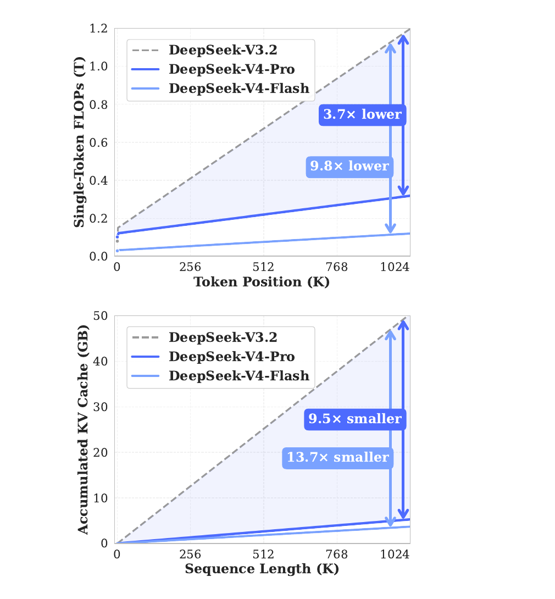

<!--
Figure 1 right panel is the punchline visual. Top = single-token
inference FLOPs vs token position at 1M context. Bottom = accumulated
KV cache vs sequence length. V3.2 is dashed grey (the baseline), V4-Pro
and V4-Flash are the blue lines.

Arrows on the chart:
  - 3.7× lower FLOPs (V4-Pro vs V3.2), 9.8× lower FLOPs (V4-Flash)
  - 9.5× smaller KV (V4-Pro vs V3.2), 13.7× smaller KV (V4-Flash)

Against a vanilla BF16 GQA-8 baseline at 1M context: V4's KV cache is
~2% of that baseline (~50× smaller). V4 paper §2.3.4.

Partial RoPE — the subtle bit. Standard attention only rotates Q and K;
V is untouched, so the output o = Σ s·v doesn't carry position. V4's
K=V sharing breaks that — rotating K means V is also rotated, so the
output sum carries each entry's absolute p_j. Applying R(-p_i) to the
output rotates p_j into p_j - p_i = relative. The "last 64 dims" choice
(only a subspace lives in positional space) is inherited from MLA's
decoupled RoPE.

Attention sink: from StreamingLLM (Xiao et al.). Models empirically
reserve junk-slot tokens for excess attention mass; making the sink
learnable and explicit removes the need for a dedicated cache token
and stabilizes training, especially in long-context + sparse where
"nothing relevant in my top-k" is common.

Open question: how much of this is also in closed frontier models
(GPT-5, Claude, Gemini)? We can't know — they don't publish — but
V4 is the best public window into what's likely shared.
-->

---

# The shape zoo — every attention pattern in one place

<AttnMask preset="causal"          :n="28" :size="150" color="#94a3b8" title="Dense (causal)" />
<AttnMask preset="sliding-window"  :n="28" :size="150" :window="5" color="#60a5fa" title="SWA (Longformer / Mistral)" />
<AttnMask preset="nsa-slc"         :n="28" :size="150" :block="4" :picks="2" color="#a78bfa" title="NSA — selected blocks" />
<AttnMask preset="dsa-topk"        :n="28" :size="150" :picks="4" color="#f472b6" title="DSA — scattered top-k" />
<AttnMask preset="v4-csa"          :n="28" :size="150" :block="4" :picks="2" :window="3" color="#34d399" title="V4 CSA — compressed + top-k + SWA" />
<AttnMask preset="v4-hca"          :n="28" :size="150" :block="8" :window="3" color="#fbbf24" title="V4 HCA — heavily compressed, dense" />

Same axes everywhere — row $i$ = query at position $i$, column $j$ = key it attends to. Coverage shrinks from full triangle (dense) → diagonal stripe (SWA) → handful of blocks (NSA / DSA / V4).

<!--
The single visual that ties (c) together. Every method we covered chooses
WHICH keys each query reads. The shapes are not arbitrary — they reflect
where each method bets the signal lives:
  - Dense: bet nothing, read everything.
  - SWA: bet locality + depth (stacked layers → effective receptive field).
  - NSA: bet on three scales (cmp + slc + win), gated.
  - DSA: bet on a learned scorer's top-k.
  - V4 CSA: bet on compressed top-k + recent window, one softmax.
  - V4 HCA: bet on a coarse summary of everything.
Patterns here are illustrative — actual block sizes and selection counts
in production are larger; the relative shape is what matters.
-->

---

# What this talk didn't cover

- **SSM / linear hybrids** — Mamba, Mamba-2, Jamba, **Nemotron-3 Super**, **Qwen 3.5** (3:1 **Gated DeltaNet** : full GQA, Feb 2026)
  - Replace attention, don't fix it
  - Linear-time recurrence, constant-state
  - Open Q: do the two threads converge?
- **Kernels & serving**
  - FlashAttention v1→v3 — IO-aware tiling, no $n{\times}n$ matrix
  - PagedAttention — KV cache as virtual memory pages
- **Distributed long-context**
  - Ring Attention — sequence-parallel attention
  - Rumored behind Gemini 1.5's 1M context
- **Other patterns**
  - MoBA (Kimi) — MoE-style routing over attention blocks
  - StreamingLLM — attention sinks

Each is its own talk.

<!--
High-level signpost slide. Don't try to teach any of these — just
acknowledge they exist and place them on the map relative to what
we did cover.

SSM thread: the "other answer" to long-context. Same bottleneck (O(n²)
prefill + O(n) decode bandwidth), different escape route. Hybrids
(Jamba, Nemotron-3) keep a few attention layers for recall and run
SSM everywhere else. The open question framing is honest — nobody
knows yet whether attention-improvements (this talk) and SSM-hybrids
converge or remain alternative paths.

Kernels: FlashAttention is the kernel that made dense O(n²) attention
*usable* at all at long context — it doesn't change asymptotics but
makes the constant tractable by never materializing the n×n softmax.
PagedAttention is the serving-layer trick that lets you manage KV
caches like virtual memory pages. Both are load-bearing for everything
in this talk to actually run at scale.

Ring Attention: distribution story, parallelism. Concurrent with
FlashAttention; cited as the rumored mechanism behind Gemini 1.5's
1M context (Google never confirmed).

MoBA / StreamingLLM: also in the sparse-attention family but didn't
warrant their own deep dive here.

Closing line — "each of these is its own talk" — invites the audience
to ask about specifics in Q&A and signals there's plenty more.
-->

---
layout: center
class: text-center
---

# Thanks

Papers and notes: [github.com/taufeeque9/attention-improvements-talk](https://github.com/taufeeque9/attention-improvements-talk)

Questions?
